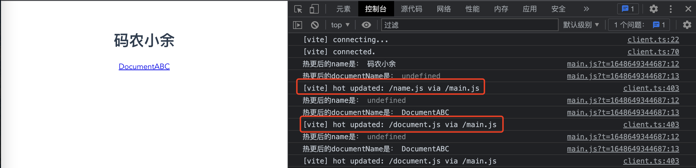
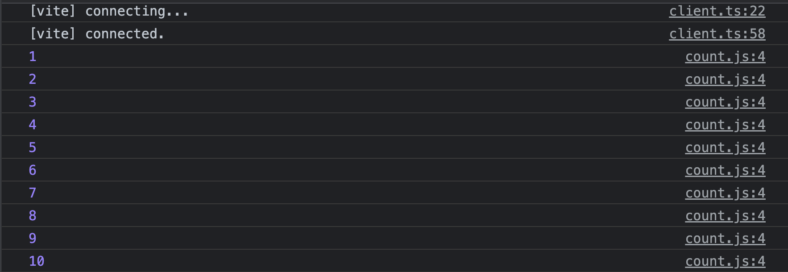
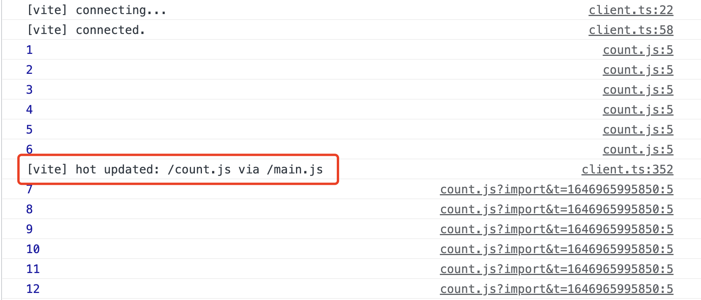

# 客户端 HMR 的 API，你熟悉吗？

大家好，我是码农小余。本节开始接触 Vite 核心特性热更新（Hot Module Replacement，简写 HMR）。


HMR 的 API 在工作中写得较少，大多数插件都会内置这些 API，比如 vite:css-post 插件埋上 accept 钩子是修改 css 文件能够触发热更的原因。作为高级的插件开发者，我们必须要能够熟练地使用热更技能。本节先来熟悉 HMR 客户端 API 的定义和作用。Vite 通过 import.meta.hot 提供这些 API：

```typescript
interface ImportMeta {
  readonly hot?: {
    // 只读的 data 属性
    readonly data: any

    // 定义热更接收的模块，有四种定义：
    // 没有参数，代表接收自身
    accept(): void
    
    // 只有一个回调函数，接收已更新模块的回调函数
    accept(cb: (mod: any) => void): void
    
    // 接收单个依赖 dep 的更新，并调用更新模块的回调函数
    accept(dep: string, cb: (mod: any) => void): void
    
    // 接收多个依赖 deps 的更新，并调用更新模块的回调函数，参数依次为deps对应的模块
    accept(deps: string[], cb: (mods: any[]) => void): void
	
    // 模块不再需要，被剔除时调用回调 cb
    prune(cb: () => void): void
    
    // 清除任何更新导致的持久副作用
    dispose(cb: (data: any) => void): void

    // 调用后直接刷新页面
    invalidate(): void

    // 模块监听热更事件
    on(event: string, cb: (...args: any[]) => void): void
  }
}
```

TypeScript 真是“行走中的文档”，通过 hot 的接口定义，我们能大概了解到 HMR 的 API 数量以及基本的参数。仅靠上述注释肯定不足以全面理解，接下来就针对每个 API 都做 DEMO 演示，让你对它们有更好的认知。

首先我们通过 `pnpm create vite hmr-app -- --template vanilla` 快速创建一个纯 JavaScript 项目，启动后进入我们的 DEMO 演示环节：

## import.meta.hot.accept

### accept(): void

```js
import './style.css'

document.querySelector('#app').innerHTML = `
  <h1>Hello Vite!</h1>
  <a href="https://vitejs.dev/guide/features.html" target="_blank">Documentation</a>
`
```

当我们不在 main.js 中写 accept 函数，并将 h1 标签里面的 “Vite” 改成 “码农小余”，浏览器页面会重新刷新，vite 服务端也会输出下面日志：


当我们加上 `import.meta.hot.accept` 函数后：

```js
import './style.css'

document.querySelector('#app').innerHTML = `
  <h1>Hello 码农小余!</h1>
  <a href="https://vitejs.dev/guide/features.html" target="_blank">Documentation</a>
`

// 添加下面三行代码
if (import.meta.hot) {
  import.meta.hot.accept()
}
```

再把 “码农小余”改成 Vite：


此时，浏览器会重新加载 main.js 而不是加载全部资源，注意 main.js 的时间戳参数已经修改了，而 Vite 服务日志显示的是 update。这说明 main.js 热更生效了。

###  accept(cb: (mod: any) => void): void

将上述代码修改成：

```js
import './style.css'

// 将 hello 的对象提取出来变量
const name = 'Vite'

document.querySelector('#app').innerHTML = `
  <h1>Hello ${name}!</h1>
  <a href="https://vitejs.dev/guide/features.html" target="_blank">Documentation</a>
`

if (import.meta.hot) {
  // 传入回调函数，参数是 newModule 表示更新后的模块信息
  import.meta.hot.accept((newModule) => {
    console.log('热更后的name是：', newModule.name)
  })
}
```

同样，我们将 Vite 改成 “码农小余”看会发生什么？


可以看到，页面上更新了，但是控制台打印的 newModule.name 是 undefined。但如果将 name export 出去，再看打印的结果：

```js
import './style.css'

// 将 hello 的对象提取出来变量，并且 export 出去
export const name = 'Vite'

document.querySelector('#app').innerHTML = `
  <h1>Hello ${name}!</h1>
  <a href="https://vitejs.dev/guide/features.html" target="_blank">Documentation</a>
`

if (import.meta.hot) {
  // 传入回调函数，参数是 newModule 表示更新后的模块信息
  import.meta.hot.accept((newModule) => {
    console.log('热更后的name是：', newModule.name)
  })
}
```

再将 name 改成“码农小余”，此时的结果就符合预期了：


### accept(dep: string, cb: (mod: any) => void): void

如果只接收模块自身的变化，那么就如上一个 DEMO 所示不需要传依赖参数，但如果要接收指定模块的变化就需要指定第一个参数。我们将上述 DEMO 修改成：

```js
// main.js
import './style.css'
import { name } from './name'

document.querySelector('#app').innerHTML = `
  <h1>Hello ${name}!</h1>
  <a href="https://vitejs.dev/guide/features.html" target="_blank">Documentation</a>
`

if (import.meta.hot) {
  import.meta.hot.accept('./name', (newModule) => {
    console.log('热更后的name是：', newModule.name)
    
    // 模块更新后的结果渲染到页面上
    document.querySelector('#app h1').textContent = newModule.name
  })
}

// name.js
export let name = '码农小余'
```

我们将 name.js 中的 name 改成 Vite 后：


三处细节值得注意，首先 name.js 模块自身没有定义 accept，但发生了热更新；在 main.js 的回调函数中，正确获取到 name 改变后的值；客户端的 console 日志是指明了通过 main.js 热更了 name.js。

### accept(deps: string[], cb: (mods: any[]) => void): void

参数是数组的情况可以监听多个依赖的变化，并且能够通过 mods 数组去获取相应的模块信息：

```typescript
// main.js
import './style.css'
import { name } from './name'
import { documentName } from './document'

document.querySelector('#app').innerHTML = `
  <h1>Hello ${name}!</h1>
  <a href="https://vitejs.dev/guide/features.html" target="_blank">${documentName}</a>
`

if (import.meta.hot) {
  import.meta.hot.accept(['./name', './document'], ([newNameModule, newDocModule]) => {
    const name = newNameModule?.name
    const documentName = newDocModule?.documentName
    console.log('热更后的name是：', name)
    console.log('热更后的documentName是：', documentName)
    
    // 模块更新后的结果渲染到页面上
    if (name) {
      document.querySelector('#app h1').textContent = name
    }
    if (documentName) {
      document.querySelector('#app a').textContent = documentName
    }
  })
}

// name.js
export let name = '码农小余'

// document.js
export let documentName = 'Document'
```

accept 接受模块数组，回到函数参数也是模块列表。在触发 ./name 变化时，newNameModule 能获取到值，而在触发 ./document 变化时，newDocModule 能获取到值。



 ## import.meta.hot.prune

将上述 name.js 加上 prune 的处理：

```js
// name.js
export let name = 'Vite'

if (import.meta.hot) {
  import.meta.hot.prune(() => {
    console.log('name.js 我被剔除了')
  })
}

// main.js
import './style.css'
import { name } from './name'

document.querySelector('#app').innerHTML = `
  <h1>Hello Vite!</h1>
  <a href="https://vitejs.dev/guide/features.html" target="_blank">Documentation</a>
`

// 必须的，如果 main.js 不是热更模块，那删除 import 语句就会直接刷新页面，就不会执行到 name.js 的 prune 函数
if (import.meta.hot) {
  import.meta.hot.accept()
}
```

上述代码中，在 main.js 模块定义了接收自身的热更，在 name.js 中定义了模块被剔除的事件回调函数。接下来我们就将 main.js 中的 `import { name } from './name'` 代码删除：


可以看到，当不再引用 name.js 时，模块被剔除后就会调用 prune 函数。

## import.meta.hot.dispose

dispose 用于清除由于更新导致的持久化副作用，我们先来看看这个例子：

```js
// main.js
import './style.css'
import './count'

if (import.meta.hot) {
  // 接受 ./count 的变化
  import.meta.hot.accept('./count')
}

// count.js
export let count = 1

const timer = setInterval(() => {
  console.log(count++)
}, 1000)
```

模块 main.js 接收 ./count 模块的变化，count.js 每隔一秒打印 count 一次，结果自然就是 1、2、3……



我们修改一下这个模块，在 `export let count = 1` 加一个 `;` 后，来看下热更结果：


可以看到，我们触发了热更新，但是老模块的定时器还存在，并且还在递增。如果我们想要销毁旧的(count.js) 定时器的影响，那么我们就要调用 dispose 方法，我们修改上述代码成：

```js
// count.js
export let count = 1;

const timer = setInterval(() => {
  console.log(count++)
}, 1000)

if (import.meta.hot) {
  import.meta.hot.dispose(() => {
    // 清理副作用
    clearInterval(timer)
  })
}
```

刷新页面后，再随便修改 count.js：


可以看到，count.js 更新了，旧模块的定时器也被清理了。

## import.meta.hot.data

从开头的接口定义可以看到，import.meta.hot.data 是一个只读对象。怎么实现数据持久化呢？我们通过一个例子来说明，上面 import.meta.hot.dispose 的例子中，热更之后数字都是从 1 开始计数，如果我们希望 count.js 的计数即使在热更之后也能持续叠加怎么做呢？

```js
// count.js

// 首先从上一个实例拿 count 变量，没有的话就是 1
export let count = import.meta.hot.data?.getCount?.()  || 1

const timer = setInterval(() => {
  console.log(count++)
}, 1000)

if (import.meta.hot) {
  // 将获取上一个实例 count 的变量封装成一个函数
  import.meta.hot.data.getCount = () => {
    return count
  }

  import.meta.hot.dispose(() => {
    // 清理副作用
    clearInterval(timer)
  })
}
```

上述 count.js 代码在上一个例子的基础上加了 import.meta.hot.data.getCount 的函数，如果定义了 getCount 了就从函数中获取 count，没有的话默认就是 1；这样处理之后我们看下效果：



可以看到，即使在热更之后，count 的数字依旧是从上一个实例的结果中继续叠加的，没有从 1 开始。这就是 import.meta.hot.data 的作用，现在再去品一下文档中的描述“`import.meta.hot.data` 对象在同一个更新模块的不同实例之间持久化。它可以用于将信息从模块的前一个版本传递到下一个版本。”就能理解其中的意义了。

## import.meta.hot.invalidate

用于刷新页面，它的实现就是大家熟知的 location.reload 。下面的 demo 也可以尝试跑一下：

```js
// count.js
export let count = import.meta.hot.data?.getCount?.() || 1;

const timer = setInterval(() => {
  console.log(count++)

  // 当计数到 10 时，重新开始
  if (count > 10) {
    import.meta.hot.invalidate()
  }
}, 1000)

if (import.meta.hot) {
  import.meta.hot.data.getCount = () => {
    return count
  }

  import.meta.hot.dispose(() => {
    // 清理副作用
    clearInterval(timer)
  })
}
```

## import.meta.hot.on

这个 API 就比较简单了，上面每一个函数都知道是做什么用的，on 就是监听上述事件发生之前的钩子，比如在模块更新 `update` 之前能监听到 vite:beforeUpdate 事件、在模块卸载 `prune` 之前会触发 vite:beforePrune 事件……

不仅是默认的插件事件，也可以在插件的 handleHotUpdate 钩子中通过 server.ws 发送自定义事件，在客户端中接收该自定义事件。

对 HMR 自定义事件感兴趣的童鞋可以参考[插件 API](https://cn.vitejs.dev/guide/api-plugin.html#handlehotupdate) 玩一下~

## 总结

HMR 的客户端 API 在我们做业务开发时用的比较少，但是很多插件都能看到它们的身影，比如 vite:css-post 插件会将上述 API 植入到构建结果中，在浏览器打开 style.css 可以看到下面结果：

```js
import { createHotContext as __vite__createHotContext } from "/@vite/client";import.meta.hot = __vite__createHotContext("/style.css");import { updateStyle as __vite__updateStyle, removeStyle as __vite__removeStyle } from "/@vite/client"
const __vite__id = "/Users/yjcjour/Documents/code/vite/examples/hmr-app/style.css"
const __vite__css = "#app {\n  font-family: Avenir, Helvetica, Arial, sans-serif;\n  -webkit-font-smoothing: antialiased;\n  -moz-osx-font-smoothing: grayscale;\n  text-align: center;\n  color: #2c3e50;\n  margin-top: 60px;\n}\n"
__vite__updateStyle(__vite__id, __vite__css)
import.meta.hot.accept()
export default __vite__css
import.meta.hot.prune(() => __vite__removeStyle(__vite__id))
```

最后的 import.meta.hot.accept() 和 import.meta.hot.prune(() => {}) 都是插件写入的代码。通过简明例子上手 HMR 客户端 API 的使用，能够帮助我们在客户端中更好地使用热更新技能，同时也能帮助我们写出易用，体验更好的插件。


