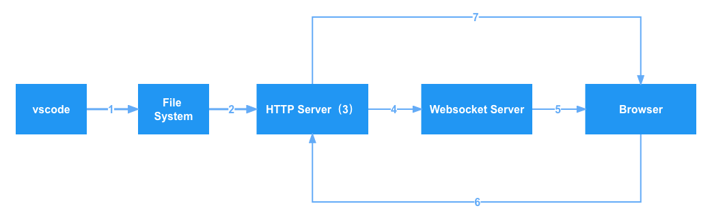
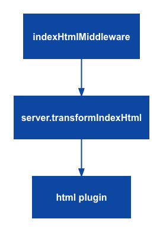
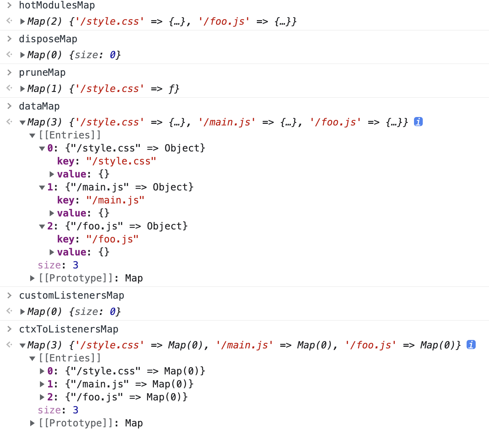
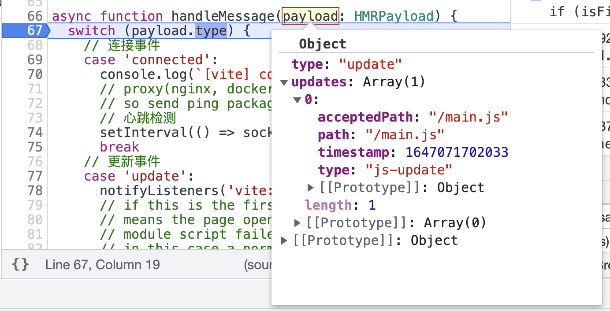
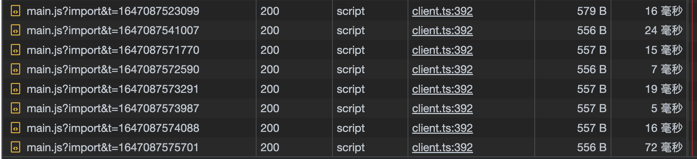
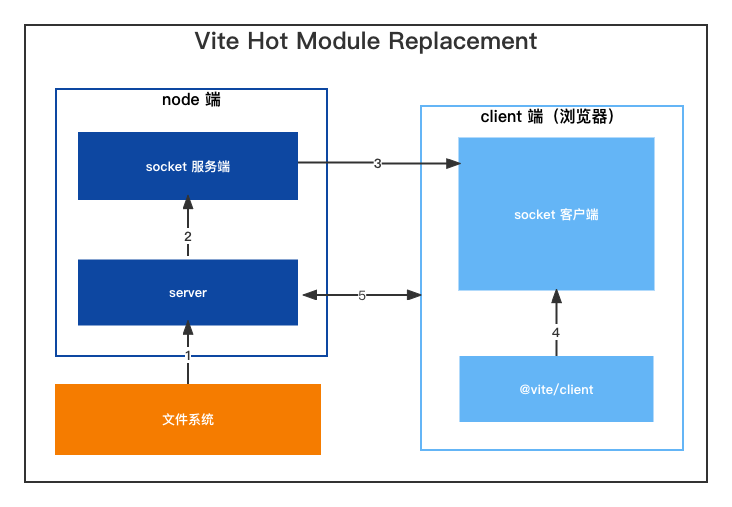

# 揭开 HMR 面纱，了解它在 client 端的实现

大家好，我是码农小余。上一小节我们知道了当文件修改后，会触发文件监听实例 watcher 的 change 事件，更新模块信息和计算 HMR 边界。Websocket 会将计算得到的更新边界传给浏览器，浏览器拿到这些信息之后具体是怎么处理的呢？本文就来解开后续秘密。



本文的例子直接复用上一小节的即可，我就直接照搬过来了：

```js
// bar.js
export const name = 'bar.js'

// foo.js
import { name } from './bar'

export function sayName () {
  console.log(name);
  return name
}

if (import.meta.hot) {
  import.meta.hot.accept('./bar.js')
}

// main.js
import './style.css'
import { sayName } from './foo'

sayName()

if (import.meta.hot) {
  import.meta.hot.accept()
}
```

## 初始化

例子跑起来，打开浏览器，我们将注意力集中到 index.html 上：

```html
<!DOCTYPE html>
<html lang="en">
  <head>
    <script type="module" src="/@vite/client"></script>

    <meta charset="UTF-8" />
    <link rel="icon" type="image/svg+xml" href="favicon.svg" />
    <meta name="viewport" content="width=device-width, initial-scale=1.0" />
    <title>Vite App</title>
  </head>
  <body>
    <div id="app"></div>
    <script type="module" src="/main.js?t=1647056310749"></script>
  </body>
</html>
```

可以看到有一个 vite 自身引入的脚本 `/@vite/client`，我们先简单了解这个脚本的引入：



当我们访问 index.html 时，会经过 indexHtmlMiddleawre 的中间件，然后调用 transformIndexHtml 钩子去做 html 文件的处理，有一个内置的 html plugin，就会将 @vite/client 写入 head-prepend 的位置，整个 html 插件的处理内容比较多，不展开在这里说了。

```typescript
// 根据服务端的协议来决定 socket 服务
const socketProtocol =
  __HMR_PROTOCOL__ || (location.protocol === 'https:' ? 'wss' : 'ws')
const socketHost = `${__HMR_HOSTNAME__ || location.hostname}:${__HMR_PORT__}`
// 初始化 socket 链接
const socket = new WebSocket(`${socketProtocol}://${socketHost}`, 'vite-hmr')
const base = __BASE__ || '/'

// 监听 socket 信息
socket.addEventListener('message', async ({ data }) => {
  handleMessage(JSON.parse(data))
})

// 处理后端返回的消息
async function handleMessage(payload: HMRPayload) {
	// ...
}
```

引入 @vite/client 脚本后，会初始化 websocket 连接，收到数据时会触发 handleMessage 事件。

知道了 vite 客户端代码的注入和 websocket 初始化之后，从浏览器上看下我们的入口文件 main.js：

```js
import { createHotContext as __vite__createHotContext } from "/@vite/client";
import.meta.hot = __vite__createHotContext("/main.js");
import '/style.css'

const fooModule = await import('/foo.js')
console.log(fooModule)

if (import.meta.hot) {
  import.meta.hot.accept()
}
```

当我们在模块中使用了 HMR 时，vite 会自动帮你引入 createHotContext 函数并生成 import.meta.hot。接下来就看看 createHotContext 函数做了哪些事，函数位于 packages/vite/src/client/client.ts：

```typescript
// 存储 accept 模块
const hotModulesMap = new Map<string, HotModule>()
// 存储 dispose 模块
const disposeMap = new Map<string, (data: any) => void | Promise<void>>()
// 存储 prune 模块
const pruneMap = new Map<string, (data: any) => void | Promise<void>>()
// 存储模块的 data 数据
const dataMap = new Map<string, any>()
// 存储模块的自定义事件
const customListenersMap = new Map<string, ((data: any) => void)[]>()
// 存储模块的默认事件
const ctxToListenersMap = new Map<
  string,
  Map<string, ((data: any) => void)[]>
>()

/**
 * 创建热更上下文
 * @param {string} ownerPath 模块路径
 */
export const createHotContext = (ownerPath: string) => {
  if (!dataMap.has(ownerPath)) {
    dataMap.set(ownerPath, {})
  }

  // when a file is hot updated, a new context is created
  // clear its stale callbacks
  const mod = hotModulesMap.get(ownerPath)
  if (mod) {
    mod.callbacks = []
  }

  // 清除过时的自定义事件监听器
  const staleListeners = ctxToListenersMap.get(ownerPath)
  if (staleListeners) {
    for (const [event, staleFns] of staleListeners) {
      const listeners = customListenersMap.get(event)
      if (listeners) {
        customListenersMap.set(
          event,
          listeners.filter((l) => !staleFns.includes(l))
        )
      }
    }
  }

  const newListeners = new Map()
  ctxToListenersMap.set(ownerPath, newListeners)

  /**
   * 收集热更模块，客户端接收到依赖的处理函数，import.meta.hot.accept
   * @param {string[]} deps 依赖的模块
   * @param {HotCallback['fn']} callback 回调函数
   */
  function acceptDeps(deps: string[], callback: HotCallback['fn'] = () => {}) {
    const mod: HotModule = hotModulesMap.get(ownerPath) || {
      id: ownerPath,
      callbacks: []
    }
    // 定义的依赖和回调存到 mod.callbacks，并更新 hotModulesMap
    mod.callbacks.push({
      deps,
      fn: callback
    })
    hotModulesMap.set(ownerPath, mod)
  }

  // HMR 客户端 API，等于 import.meta.hot
  const hot = {
    get data() {
      return dataMap.get(ownerPath)
    },

    accept(deps: any, callback?: any) {
      // 对应 import.meta.hot.accept(() => {}) 的用法
      // self-accept: hot.accept(() => {})
      if (typeof deps === 'function' || !deps) {
        acceptDeps([ownerPath], ([mod]) => deps && deps(mod))
      // 对应 import.meta.hot.accept('./bar.js', () => {}) 的用法
      } else if (typeof deps === 'string') {
        // explicit deps
        acceptDeps([deps], ([mod]) => callback && callback(mod))
      // 对应 import.meta.hot.accept(['./bar.js', './foo.js'], () => {}) 的用法
      } else if (Array.isArray(deps)) {
        acceptDeps(deps, callback)
      } else {
        throw new Error(`invalid hot.accept() usage.`)
      }
    },

    // 即将废弃的 API，有⚠️信息，开发友好
    acceptDeps() {
      throw new Error(
        `hot.acceptDeps() is deprecated. ` +
          `Use hot.accept() with the same signature instead.`
      )
    },

    // 清除任何更新导致的持久副作用
    dispose(cb: (data: any) => void) {
      disposeMap.set(ownerPath, cb)
    },

    // 模块不再需要
    prune(cb: (data: any) => void) {
      pruneMap.set(ownerPath, cb)
    },

    // TODO
    // eslint-disable-next-line @typescript-eslint/no-empty-function
    decline() {},

    // 调用 import.meta.hot.invalidate 等于 location.reload，刷新页面
    invalidate() {
      // TODO should tell the server to re-perform hmr propagation
      // from this module as root
      location.reload()
    },

    // 自定义事件
    on: (event: string, cb: (data: any) => void) => {
      const addToMap = (map: Map<string, any[]>) => {
        const existing = map.get(event) || []
        existing.push(cb)
        map.set(event, existing)
      }
      addToMap(customListenersMap)
      addToMap(newListeners)
    }
  }

  return hot
}
```

createHotContext 是客户端的热更新初始化流程，将所有热更模块信息收集起来放到模块全局变量中。对于本例子而言，style.css 在内置插件 vite:css-post 会默认插入热更代码，main.js 和 foo.js 都是我们手动写入的。最终写入的模块变量如下图所示：



## 更新流程

websocket 连接并收集完模块的热更信息之后，我们修改一下文件之后，上篇我们已经知道服务端的处理方式。在客户端我们通过 websocket 的 message 钩子接收到消息：



```typescript
async function handleMessage(payload: HMRPayload) {
  switch (payload.type) {
		// ...      
    // 更新事件
    case 'update':
      notifyListeners('vite:beforeUpdate', payload)
      // if this is the first update and there's already an error overlay, it
      // means the page opened with existing server compile error and the whole
      // module script failed to load (since one of the nested imports is 500).
      // in this case a normal update won't work and a full reload is needed.
      if (isFirstUpdate && hasErrorOverlay()) {
        window.location.reload()
        return
      } else {
        // 清除错误层
        clearErrorOverlay()
        isFirstUpdate = false
      }
      // 遍历server发回的更新列表
      payload.updates.forEach((update) => {
        if (update.type === 'js-update') {
          queueUpdate(fetchUpdate(update))
        } else {
          // css-update
          // ..
          }
          console.log(`[vite] css hot updated: ${searchUrl}`)
        }
      })
      break
		// ...

  }
}
```

可以看到，我们接收到的消息 type: update，进入 update 分支。首先是通过 notifyListeners 调用全部 beforeUpdate 事件。接着判断是否有错误遮罩层，如果有并且是首次更新就直接刷新页面了，否则清除错误遮罩然后依次更新模块。本文的例子修改的是 main.js，所以模块的更新的类型是 js-update，我们看看 fetchUpdate 函数：

```typescript
/**
 * 加载更新
 */
async function fetchUpdate({ path, acceptedPath, timestamp }: Update) {
  const mod = hotModulesMap.get(path)
  if (!mod) {
    // In a code-splitting project,
    // it is common that the hot-updating module is not loaded yet.
    // https://github.com/vitejs/vite/issues/721
    return
  }

  const moduleMap = new Map()
  // 自我更新
  const isSelfUpdate = path === acceptedPath

  // make sure we only import each dep once
  // 生成需要更新的模块集合
  const modulesToUpdate = new Set<string>()
  // 更新自己就把自己加入到集合
  if (isSelfUpdate) {
    // self update - only update self
    modulesToUpdate.add(path)
  } else {
    // dep update
    // 依赖更新
    for (const { deps } of mod.callbacks) {
      deps.forEach((dep) => {
        if (acceptedPath === dep) {
          modulesToUpdate.add(dep)
        }
      })
    }
  }

  // determine the qualified callbacks before we re-import the modules
  const qualifiedCallbacks = mod.callbacks.filter(({ deps }) => {
    return deps.some((dep) => modulesToUpdate.has(dep))
  })

  await Promise.all(
    Array.from(modulesToUpdate).map(async (dep) => {
      // 销毁定义了 dispose 的实例
      const disposer = disposeMap.get(dep)
      if (disposer) await disposer(dataMap.get(dep))
      const [path, query] = dep.split(`?`)
      try {
        const newMod = await import(
          /* @vite-ignore */
          base +
            path.slice(1) +
            `?import&t=${timestamp}${query ? `&${query}` : ''}`
        )
        moduleMap.set(dep, newMod)
      } catch (e) {
        warnFailedFetch(e, dep)
      }
    })
  )

  return () => {
    for (const { deps, fn } of qualifiedCallbacks) {
      fn(deps.map((dep) => moduleMap.get(dep)))
    }
    const loggedPath = isSelfUpdate ? path : `${acceptedPath} via ${path}`
    console.log(`[vite] hot updated: ${loggedPath}`)
  }
}
```

根据 path 从 hotModulesMap 中获取模块信息，如果模块不存在就直接终止，存在则判断是否“自我接受”，是的话就把自己加入到待更新集合，否则就去遍历全部 deps 加入到更新集合并重新获取回调函数。之后遍历待更新队列 modulesToUpdate，如果模块有 dispose 函数的定义就清除副作用。再就是来到最核心的地方，通过动态 import 去加载最新的资源并更新模块信息，保证最后的回调拿到的模块是最新的。



从上图可以看到，每次修改文件都会用最新的时间戳去请求资源。请求发出之后，又会回到 vite 服务端的 transformMiddleware，这部分流程在模块图中已经分析过了，忘记的童鞋可以回头看下[模块之间的依赖关系是一个图](./模块之间的依赖关系是一个图.md)流程。

fetchUpdate 最后返回一个函数，通过 queueUpdate 保证回调函数的执行顺序跟 http 请求的一致：

```typescript
let pending = false
let queued: Promise<(() => void) | undefined>[] = []

/**
 * 缓冲由同一个 src 更改触发的多个热更新，以便按照它们发送的相同顺序调用它们。
 * 否则顺序可能因为 http 请求往返而不一致
 */
async function queueUpdate(p: Promise<(() => void) | undefined>) {
  // 先将全部回调函数推到 queued
  queued.push(p)
  if (!pending) {
    pending = true
    await Promise.resolve()
    pending = false
    const loading = [...queued]
    queued = []
    ;(await Promise.all(loading)).forEach((fn) => fn && fn())
  }
}
```

## 总结

最后用一张图做整个 HMR 回顾：



1. 当文件发生改变，文件系统已经能够监测到文件元信息比如修改时间改变之后，触发 server watcher 的 change 事件；
2. server 拿到修改的文件，更新 moduleGraph 上的模块节点信息，主要是将 tansformResult 和 ssr 相关的生成结果清空；然后计算更新策略：如果修改的是 vite 配置或环境变量相关的文件，就重启服务；如果修改的是 @vite/client 或 html，直接刷新页面；上述都不是的话，就调用插件的 handleHotUpdate 钩子得到最终的热更列表 hmrContext.modules 去做“边界”计算。计算“边界”主要是遍历模块列表，更新模块的最近热更时间、置空 transformResult 字段，再根据热更客户端 API 的参数对模块的引用者（importers）做同样的更新；最后根据模块间是否存在循环引用等情况判断是否存在“死路”。
3. 根据是否存在“死路”，是的话就向客户端发送 full-reload 命令，否则的话就发送 update 命令；
4. 当我们在浏览器在打开 vite server 链接时，会加载 index.html 文件。加载过程会请求到 server 上的 indexHtmlMiddleawre 中间件，进而调用插件的 transformIndexHtml 钩子对 html 做转换，其中内置的 html 插件会将 @vite/client 写入到 index.html 。加载 @vite/client 会初始化客户端的 websocket 实例，监听服务端的消息，还定义 createHotContext 函数，并在每个使用了 HMR API 的模块中引入并调用该函数，这也是为什么我们能在模块中使用 import.meta.hot 等一系列 API 的根因。
5. 最后当客户端 websocket 接收到 update 或者 full-reload 指令时，会做出相应的动作。full-reload 会执行 location.reload ，update 收集并更新热更模块后动态加载模块资源，加载资源又会回到 server 的 transformMiddleware 做模块的 transform 和 moduleGraph 信息的更新，最终执行 accept(cb) 中的回调函数。

至此，整个热更新的流程我们就清楚了。上篇主要讲服务端的处理；下篇讲客户端的处理，中间也接触了中间件和插件的 transformIndexHtml 钩子以及内置的 html 插件，但都是一笔带过，其实像 vite:build-html 插件还是比较复杂的，感兴趣的童鞋可以去调试一些插件源码。下一小节我们就去了解核心模块的最后一节——预编译。