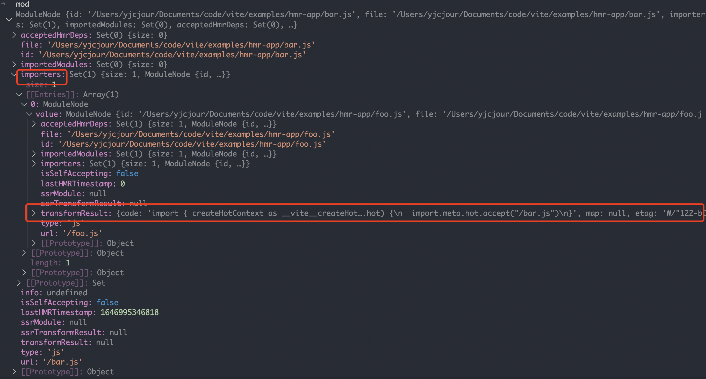
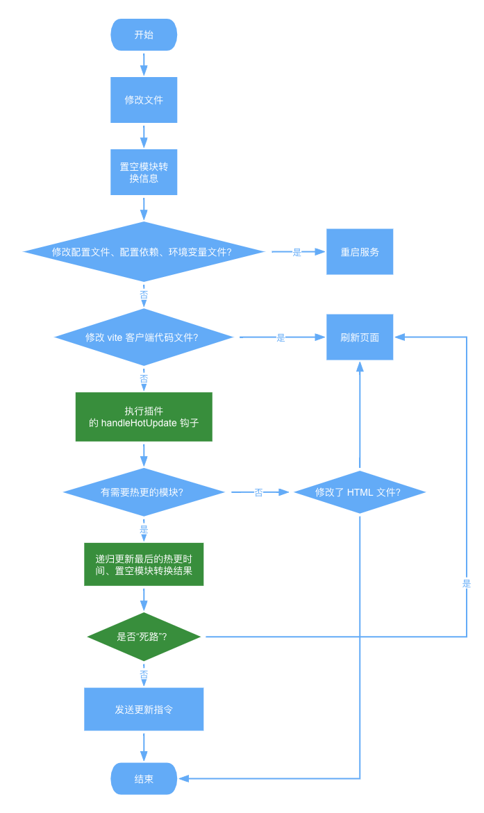

#  揭开 HMR 面纱，了解它在 node 端的实现

大家好，我是码农小余。上一小节我们学习了 HMR 的 客户端 API，对于常见的热更接收机制、热更失效、多实例变量缓存都有了比较清晰的认知。本节我们就先从 node 端去探索 HMR 的实现原理。


当我们在 vscode（或其它代码编辑器）修改一行代码时，会触发文件变化，然后被 Vite server 上的文件监听实例（在[初始化配置创建服务](./create-server.md)一节，知道了服务通过 [chokidar](https://www.npmjs.com/package/chokidar) 去创建了文件监听实例）获取到文件变化触发 change 事件：

```typescript
// 文件改变时触发事件
watcher.on('change', async (file) => {
  // 规范化文件路径，将\\替换成/
  file = normalizePath(file)
  
  // ...
})

// 添加文件事件
watcher.on('add', (file) => {
  handleFileAddUnlink(normalizePath(file), server)
})

// 删除文件事件
watcher.on('unlink', (file) => {
  handleFileAddUnlink(normalizePath(file), server, true)
})
```

当有文件添加到当前目录时，就会触发 add 事件；当有文件在当前目录被删除时，就会触发 unlink 事件；当我们修改了代码，就会触发 change 事件。所以我们就在 `file = normalizePath(file)` 打上断点，开始这一小节的调试。

按照惯例，我们先准备一个例子，用 vanillar 模板创建一个 Vite 项目，然后创建 bar.js 和 foo.js 文件，代码如下：

```js
// bar.js
export const name = 'bar.js'

// foo.js
import { name } from './bar'

export function sayName () {
  console.log(name);
  return name
}

if (import.meta.hot) {
  import.meta.hot.accept('./bar.js')
}

// main.js
import './style.css'
import { sayName } from './foo'

sayName()

if (import.meta.hot) {
  import.meta.hot.accept()
}
```

main.js 引用 foo.js 和 style.css，foo.js 引用 bar.js，模块的依赖图如下所示：


修改 bar.js 文件后，触发 watcher 的 change 的事件：

```typescript
// 文件改变时触发事件
watcher.on('change', async (file) => {
  // 规范化文件路径，将\\替换成/
  file = normalizePath(file)
  if (file.endsWith('/package.json')) {
    return invalidatePackageData(packageCache, file)
  }
  // invalidate module graph cache on file change
  moduleGraph.onFileChange(file)
  if (serverConfig.hmr !== false) {
    try {
      await handleHMRUpdate(file, server)
    } catch (err) {
      ws.send({
        type: 'error',
        err: prepareError(err)
      })
    }
  }
})
```

回调中拿到文件路径 file 进行 normalizePath，接着调用 `moduleGraph.onFileChange(file)`：

```typescript
/**
   * 文件修改的事件
   */
onFileChange(file: string): void {
  // 根据文件获取模块信息
  const mods = this.getModulesByFile(file)
  if (mods) {
    const seen = new Set<ModuleNode>()
    mods.forEach((mod) => {
      this.invalidateModule(mod, seen)
    })
  }
}

/**
 * 处理失效的模块
 */
invalidateModule(mod: ModuleNode, seen: Set<ModuleNode> = new Set()): void {
  mod.info = undefined
  mod.transformResult = null
  mod.ssrTransformResult = null
  // ...
}
```

对于 bar.js 文件，mods 信息如下：


所有模块循环调用 invalidateModule，就是将文件对应模块的 info、transformResult、ssrTransformResult 都置为 null；至于为什么要循环，因为一个文件对应的不止一个模块，比如 vue 的 SFC，一个 vue 文件会对应多个模块。

模块信息处理完了之后，就会开始执行热更 `await handleHMRUpdate(file, server)`：

```typescript
export async function handleHMRUpdate(
  file: string,
  server: ViteDevServer
): Promise<any> {
  const { ws, config, moduleGraph } = server
  // 获取简短文件名，对于本例子就是 bar.js
  const shortFile = getShortName(file, config.root)

  // 配置文件修改，比如 vite.config.ts
  const isConfig = file === config.configFile
  // 配置文件的依赖
  const isConfigDependency = config.configFileDependencies.some(
    (name) => file === path.resolve(name)
  )
  // 环境变量文件
  const isEnv =
    config.inlineConfig.envFile !== false &&
    (file === '.env' || file.startsWith('.env.'))

  // 如果是配置文件修改了，直接重启服务
  if (isConfig || isConfigDependency || isEnv) {
    // auto restart server
    try {
      await server.restart()
    } catch (e) {
      config.logger.error(colors.red(e))
    }
    return
  }

  // vite 的 client 修改了，全量刷新 -> 刷新页面
  if (file.startsWith(normalizedClientDir)) {
    ws.send({
      type: 'full-reload',
      path: '*'
    })
    return
  }

  // 获取文件关联的模块
  const mods = moduleGraph.getModulesByFile(file)

  // check if any plugin wants to perform custom HMR handling
  const timestamp = Date.now()
  // 热更上下文
  const hmrContext: HmrContext = {
    // 文件
    file,
    // 时间戳
    timestamp,
    // 受更改文件影响的模块数组
    modules: mods ? [...mods] : [],
    // 这是一个异步读函数，它返回文件的内容。之所以这样做，是因为在某些系统上，文件更改的回调函数可能会在编辑器完成文件更新之前过快地触发
    // 并 fs.readFile 直接会返回空内容。传入的 read 函数规范了这种行为。
    read: () => readModifiedFile(file),
    // 整个服务对象
    server
  }

  // 遍历插件，调用 handleHotUpdate 钩子
  for (const plugin of config.plugins) {
    if (plugin.handleHotUpdate) {
      const filteredModules = await plugin.handleHotUpdate(hmrContext)

      // 受更改文件影响的模块数组
      if (filteredModules) {
        hmrContext.modules = filteredModules
      }
    }
  }

  // 文件修改没有影响其他模块
  if (!hmrContext.modules.length) {
    // 是 html 的话，直接刷新页面
    if (file.endsWith('.html')) {
      ws.send({
        type: 'full-reload',
        path: config.server.middlewareMode
          ? '*'
          : '/' + normalizePath(path.relative(config.root, file))
      })
    }
    return
  }

  // 核心，执行模块更新
  updateModules(shortFile, hmrContext.modules, timestamp, server)
}
```

handleHMRUpdate 主要处理了：

1. 如果修改的是 vite.config.ts 或它的依赖文件，亦或者是环境变量的定义文件，都直接重启服务；
2. 如果修改的是 vite 自带的 client 脚本，就刷新页面；
3. 如果上述两种情况都不是，就定义 hmrContext 对象， 定义包含了 file 当前文件路径、timestamp 当前时间戳、modules 文件映射的模块、read 函数读取该文件内容、server 整个服务器对象；有了 hmrContext 之后，依次调用插件的 handleHotUpdate 钩子，钩子可以返回热更需要关联的模块，具体可以查看[官方 HMR API](https://cn.vitejs.dev/guide/api-plugin.html#handlehotupdate) 。如果没有关联的模块，并且修改的是 html 文件，发送 full-reload 进行页面刷新；前面几个条件都不满足的话，就调用 updateModules 。

```typescript
/**
 * 更新模块
 * @param {string} file 文件路径
 * @param {ModuleNode[]} modules 影响的模块
 * @param {number} timestamp 当前时间的时间戳
 * @poram {ViteDevServer} server 服务对象
 */
function updateModules(
  file: string,
  modules: ModuleNode[],
  timestamp: number,
  { config, ws }: ViteDevServer
) {
  // 更新的列表
  const updates: Update[] = []

  // 失效模块
  const invalidatedModules = new Set<ModuleNode>()
  // 页面刷新符号
  let needFullReload = false

  for (const mod of modules) {
    invalidate(mod, timestamp, invalidatedModules)
    // 如果需要重新刷新，不再去计算边界
    if (needFullReload) {
      continue
    }

    const boundaries = new Set<{
      boundary: ModuleNode
      acceptedVia: ModuleNode
    }>()
    // 死路标志
    const hasDeadEnd = propagateUpdate(mod, boundaries)
    // 死路的话直接刷新页面
    if (hasDeadEnd) {
      needFullReload = true
      continue
    }

    // 否则的话，遍历全部边界，触发模块更新
    updates.push(
      ...[...boundaries].map(({ boundary, acceptedVia }) => ({
        type: `${boundary.type}-update` as Update['type'],
        timestamp,
        path: boundary.url,
        acceptedPath: acceptedVia.url
      }))
    )
  }

  if (needFullReload) {
    ws.send({
      type: 'full-reload'
    })
  } else {
    // ...
    // 触发全部模块的更新
    ws.send({
      type: 'update',
      updates
    })
  }
}
```

上述代码遍历 modules，调用 invalidate 更新模块和引用者（importers）的信息，声明 HMR 边界（“**接受**” 热更新的模块），调用 propagateUpdate 判断模块之前是否存在“死路”，如果存在“死路”就直接发起 full-reload 命令刷新页面，否则发起 update 命令执行指定模块（updates）的更新。客户端接收命令的处理方式我们放在下篇去分析。

## invalidate

上述流程有两个细节我们略过了，现在先来看看 invalidate 的处理：

```typescript
/**
 * 处理失效模块
 * @param {ModuleNode} mod 模块节点
 * @param {number} timestamp 当前时间
 * @param {Set<ModuleNode>} seen
 */
function invalidate(mod: ModuleNode, timestamp: number, seen: Set<ModuleNode>) {
  if (seen.has(mod)) {
    return
  }
  seen.add(mod)
  mod.lastHMRTimestamp = timestamp
  // 置空一系列信息
  mod.transformResult = null
  mod.ssrModule = null
  mod.ssrTransformResult = null
  // 遍历依赖者，如果热更新的模块中不存在该模块
  mod.importers.forEach((importer) => {
    // 当前模块热更的依赖不包含当前模块，accept 的参数，例子中 foo 是 bar 的引用者，这里的判断是 true；
    // 如果不存在也就是 accept 的参数是空时就清空引用者的信息
    if (!importer.acceptedHmrDeps.has(mod)) {
      invalidate(importer, timestamp, seen)
    }
  })
}
```

invalidate 函数更新了模块的最后热更时间，并将代码转换（transformResult、ssrTransformResult）置空，最后遍历模块的引用者（importers，也可叫作前置依赖，具体指哪些模块引用了该模块）。importer.acceptedHmrDeps 获取到的是模块中 import.meta.hot.accept 的 dep(s) 参数，对于本文的例子而言，mod 就是我们修改的文件 bar.js 指向的模块，importers 指的是 foo.js，所以 importer.acceptedHmrDeps 就是代码 `import.meta.hot.accept('./bar.js')` 中的 dep 参数代表的模块集合，即 './bar.js' 文件指向的模块，所以经过 invalidate 处理之后的结果如下：



因为引用者 foo.js 接受 bar.js 模块的更新， 所以 `importer.acceptedHmrDeps.has(mod)` 返回的是 true，取反后就不会执行内部的 invalidate。所以上述结果中 importers 中的 foo.js 模块 transformResult 结果没有置空。

## propagateUpdate

接下来再来看看 propagateUpdate 是如何判断“死路”和生成 HMR 边界。

```typescript
/**
 * 更新冒泡
 * @param {ModuleNode} node 当前更新的模块
 * @param {Set<{ boundary: ModuleNode acceptedVia: ModuleNode }>} boundaries 边界
 * @param {ModuleNode[]} currentChain
 * @returns {boolean} 是否死路
 */
function propagateUpdate(
  node: ModuleNode,
  boundaries: Set<{
    boundary: ModuleNode
    acceptedVia: ModuleNode
  }>,
  currentChain: ModuleNode[] = [node]
): boolean /* hasDeadEnd */ {
  // 如果模块自我“接受”，加入到边界数组中
  if (node.isSelfAccepting) {
    boundaries.add({
      boundary: node,
      acceptedVia: node
    })

    // additionally check for CSS importers, since a PostCSS plugin like
    // Tailwind JIT may register any file as a dependency to a CSS file.
    // 将 css 相关的资源引入全部加到 boundaries
    for (const importer of node.importers) {
      if (isCSSRequest(importer.url) && !currentChain.includes(importer)) {
        propagateUpdate(importer, boundaries, currentChain.concat(importer))
      }
    }

    return false
  }

  // 没有依赖
  if (!node.importers.size) {
    return true
  }

  // #3716, #3913
  // For a non-CSS file, if all of its importers are CSS files (registered via
  // PostCSS plugins) it should be considered a dead end and force full reload.
  if (
    !isCSSRequest(node.url) &&
    [...node.importers].every((i) => isCSSRequest(i.url))
  ) {
    return true
  }

  // 遍历当前模块的依赖
  for (const importer of node.importers) {
    const subChain = currentChain.concat(importer)
    if (importer.acceptedHmrDeps.has(node)) {
      boundaries.add({
        boundary: importer,
        acceptedVia: node
      })
      continue
    }

    // 循环引用直接刷新
    if (currentChain.includes(importer)) {
      // circular deps is considered dead end
      return true
    }

    if (propagateUpdate(importer, boundaries, subChain)) {
      return true
    }
  }
  return false
}
```

进来就看到一个陌生的玩意——isSelfAccepting（自我“接受”）。自我“接受”的模块指的是那些定义了 `import.meta.hot.accept()` 或者`import.meta.hot.accept(() => {})` 函数的模块，注意！accept 没有传依赖参数！比如例子中的 main.js 就是热更自我“接受”的。

对于这类模块，首先应该加入到 boundaries。接下来是对 css 的处理，对于模块引用者有 css 的全部递归加入到 boundaries。后续比较重要的逻辑就是遍历模块引用者，拼接 HMR 链了，如果被引用者的“接受”，就添加到边界数组 boundaries 中，否则就判断是否存在循环引用，是的话就属于“死路”；最终将引用者继续递归重复上述流程。

## 总结

文章开头的那张图再回头看一下：


学习完这一小节，我们知道了步骤1、2、3、4 具体做了什么：

1. 当我们在 vscode 上修改一行代码时，会触发文件变化；

2. 文件信息（修改时间、内容）改变之后，会触发 Vite Server 上的 watcher 实例的 change 事件；

3. Vite Server 对修改文件做了很多事情，具体可以看下图：

   

4. 最后 server 将需要更新的文件相关信息通过 socket 服务发往 socket 客户端；

下篇我们就去看看 socket 客户端接收到修改文件的信息会如何触发真实的更新。


