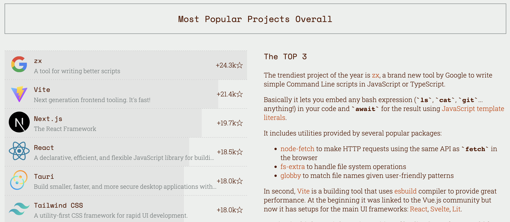
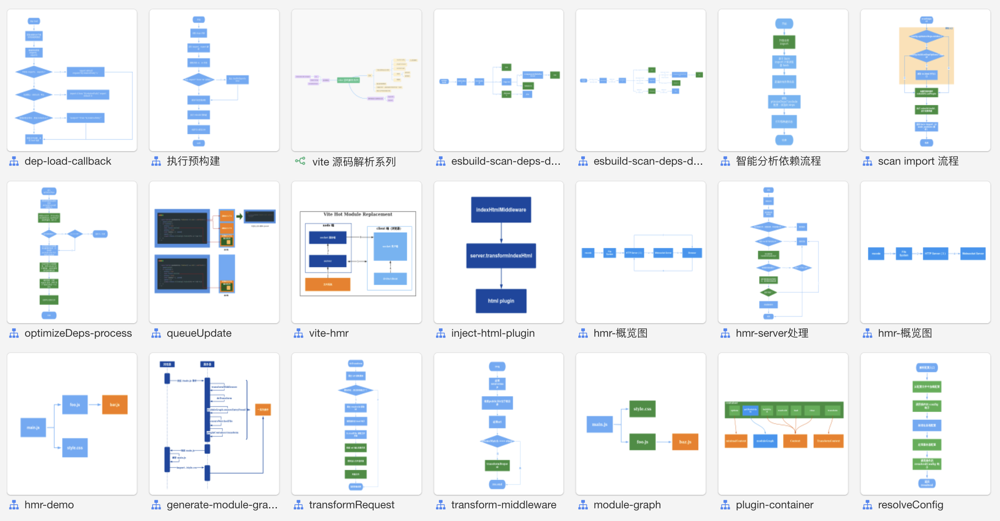

# 开端

大家好，我是码农小余。很高兴能跟你们在《Vite 技术揭秘》见面。此开端非彼“开端”，看了、学了，成果都是实打实的，知识不会循环消失。

在 2021 年的 JavaSript 明星项目的排名上，Vite 可谓是风生水起，在总排名和工程化上都有很亮眼的表现。

在总体上排名第二；

在构建工具上排名第一；截止到小余写本文时，Vite stars 已经 39k stars，并有一举超越 webpack 之势：

如此火热的前端构建工具到底有哪些优势？

## 为什么需要 Vite？

Webpack 是一个典型的 Bundle based 的构建工具，在启动 dev server 之前，会抓取、处理和连接整个应用的 JavaScript 文件，这包括 dependencies 和开发者手写的应用代码。对于一个大型项目而言，每次启动 dev server 都要好几分钟甚至是十几分钟才能看到页面效果；启动后即使有 HMR，也还是需要经过构建之后才会更新，这一般也需要几秒的热更时间。

“摸鱼”不是我想的，但是我也没辄啊，它就是慢。这很明显地降低开发体验（developer experience，简称 DX）。此时就会要求你升级成 Bundless 框架。

那么什么是 Bundless 呢？简而言之，就是利用浏览器支持 module 的能力，将 JavaScript 文件直接通过 import 进行加载。方案代表是 Vite，Vite 通过一系列手段提高 dev 下的性能，比如区分依赖模块（node_modules）和应用程序模块（开发者写的代码）、充分利用浏览器的缓存、基于模块的 HMR 能力等。这一整套组合拳下来，“摸鱼”时间基本芭比Q了，开发者的体验瞬间上了一个档次。不仅于此，最近 Vite@v2.9.x-beta 版本还在优化冷启动时间，详情可以看 [issue](https://github.com/vitejs/vite/pull/6758)。

## 为什么要阅读 Vite 源码？

### Vite 流程概览

阅读 Vite 源码，对于框架本身，能够了解它的主流程和内部细节：

当我们在终端上敲入 `vite` 命令时，会依次执行：

#### resolveConfig

获取配置文件如 vite.config.ts 中的配置，并组合默认和命令行配置，生成贯穿整个 vite node 端的 config；

#### createServer

从 config 中获取 server 的相关配置，创建 http 或者 https 服务，创建 websocket 服务，最后通过 connect （express 中间件机制）创建中间件实例；

#### watcher

使用 chokidar 包创建文件监听实例，并监听文件的修改、添加、删除等；

#### new ModuleGraph

生成模块图谱实例，实例上有很多对模块的操作，比如通过文件、URL、id去获取模块信息、更新模块、删除模块信息等等。

整个应用的模块关联又会通过 importAnalysis 这个 vite 插件去形成。

#### createPluginContainer

插件容器，统一纳管 vite 全部插件。定义钩子以及跟 rollup 插件的关系、插件钩子的执行时机都在这个环节中。

#### server.listen

完事具备之后，就会触发插件的 buildStart 钩子并开始 runOptimize，执行预构建。

### Vite 之外的森林

除开 Vite 框架本身，能够学习到如何实现一个**易用、高扩展的**命令行工具，比如在定义配置时，通过 defineConfig 函数能够给非常友好的配置提示。但是工具内部怎么获取配置内容呢？当我们读完 [你知道 Vite 默默地帮你配置什么吗？](./你知道 Vite 默默地帮你配置什么吗？.md) 一节时，知道 vite 对配置文件 vite.config.ts 的处理是通过 esbuild 编译配置文件之后再扩展 require.extensions 去获取内容，就可以模仿这种处理方式，让我们的工具更易用。当我们了解插件容器的设计之后，我们能够实现一个高扩展性的插件机制。

## 小册特征

- **食用人群：前端均可**。虽然这是一本 Vite 源码小册， 但如何上面所陈述的，源于 Vite 也高于 Vite，这才是我们阅读源码的目的。除了能够快速地解决工作上的问题，也能从代码中学习到“如何面向大佬地写代码”技巧等等。

- **磨刀不误砍柴工，不仅授鱼，还授渔**。在小册的第一节，会介绍如何进行 CLI 工具的调试，希望读者能够跟着步骤把调试环境准备好。在每一节的开始之前，都会让读者准备一个满足需求的最小 DEMO，屏蔽分支逻辑，专注在主流程。

- **图文结合**，对于超长或复杂的代码逻辑，都会有对应的流程图辅助理解大概，对于其中复杂的流程会标记成绿色方块，并单独剖析；

  

**最后，让我们一起进入这片森林，探索 Vite 的秘密。**
