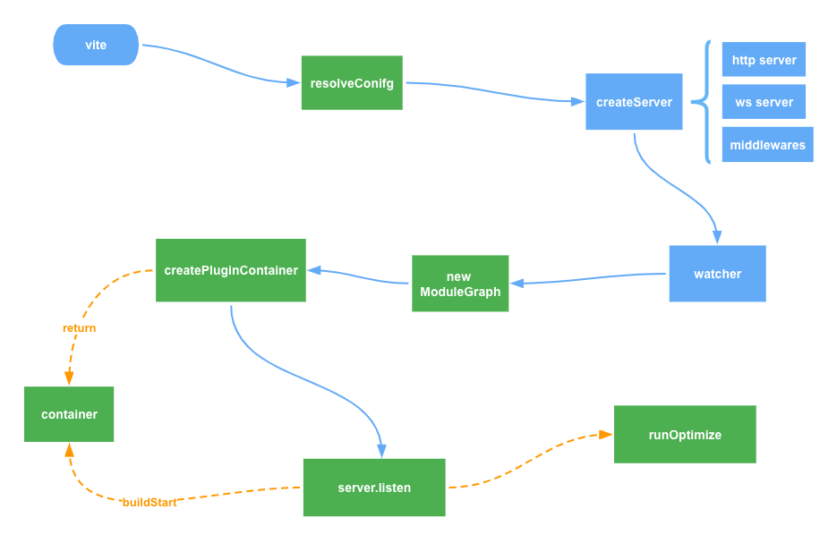

# 敲下命令后，Vite 做了哪些事？

大家好，我是码农小余。

在“开端”一文中，我们知道了当在终端敲下 vite（vite dev、vite server）到返回下图结果


中间发生的事情。

本文就从代码出发，加深全流程的印象。我们直接看到源码入口：

```typescript
import { cac } from 'cac'

const cli = cac('vite')

// ...

/**
 * 对于特定子命令时删除全局的参数
 */
function cleanOptions<Options extends GlobalCLIOptions>(
  options: Options
): Omit<Options, keyof GlobalCLIOptions> {
  const ret = { ...options }
  delete ret['--']
  delete ret.c
  delete ret.config
  delete ret.base
  delete ret.l
  delete ret.logLevel
  delete ret.clearScreen
  delete ret.d
  delete ret.debug
  delete ret.f
  delete ret.filter
  delete ret.m
  delete ret.mode
  return ret
}

// 全局公共参数
cli
  .option('-c, --config <file>', `[string] use specified config file`)
  .option('--base <path>', `[string] public base path (default: /)`)
  .option('-l, --logLevel <level>', `[string] info | warn | error | silent`)
  .option('--clearScreen', `[boolean] allow/disable clear screen when logging`)
  .option('-d, --debug [feat]', `[string | boolean] show debug logs`)
  .option('-f, --filter <filter>', `[string] filter debug logs`)
  .option('-m, --mode <mode>', `[string] set env mode`)

cli
  .command('[root]', 'start dev server') // default command
  .alias('serve') // the command is called 'serve' in Vite's API
  .alias('dev') // alias to align with the script name
  .option('--host [host]', `[string] specify hostname`)
  .option('--port <port>', `[number] specify port`)
  .option('--https', `[boolean] use TLS + HTTP/2`)
  .option('--open [path]', `[boolean | string] open browser on startup`)
  .option('--cors', `[boolean] enable CORS`)
  .option('--strictPort', `[boolean] exit if specified port is already in use`)
  .option(
    '--force',
    `[boolean] force the optimizer to ignore the cache and re-bundle`
  )
  .action(async (root: string, options: ServerOptions & GlobalCLIOptions) => {
    // output structure is preserved even after bundling so require()
    // is ok here
  	// 
    const { createServer } = await import('./server')
    try {
      // options 获取命令行参数
      const server = await createServer({
        root,
        base: options.base,
        mode: options.mode,
        configFile: options.config,
        logLevel: options.logLevel,
        clearScreen: options.clearScreen,
        server: cleanOptions(options)
      })

      if (!server.httpServer) {
        throw new Error('HTTP server not available')
      }

      await server.listen()

      const info = server.config.logger.info

      info(
        colors.cyan(`\n  vite v${require('vite/package.json').version}`) +
          colors.green(` dev server running at:\n`),
        {
          clear: !server.config.logger.hasWarned
        }
      )

      server.printUrls()

      // @ts-ignore
      // 启动性能
      if (global.__vite_start_time) {
        // @ts-ignore
        const startupDuration = performance.now() - global.__vite_start_time
        info(
          `\n  ${colors.cyan(`ready in ${Math.ceil(startupDuration)}ms.`)}\n`
        )
      }
    } catch (e) {
      createLogger(options.logLevel).error(
        colors.red(`error when starting dev server:\n${e.stack}`),
        { error: e }
      )
      process.exit(1)
    }
  })

// ...
```

上述代码中，通过 [cac](https://www.npmjs.com/package/cac) 创建 CLI 应用，包特点是：

- 超级轻量，没有任何依赖，就一个文件；
- 简单上手，只需要 4 个 APIs 就能开发一个 CLI 应用：`cli.option` `cli.version` `cli.help` `cli.parse`；
- 麻雀虽小，五脏俱全。启用默认命令、类 git 子命令、验证所需参数和选项、可变参数、嵌套选项、自动帮助消息生成等功能。
- 开发友好型，工具使用 TypeScript 开发的。

定义了如下全局的配置：

```typescript
// 从 TS 的接口类型了解参数再友好不过啦
interface GlobalCLIOptions {
  '--'?: string[]
  c?: boolean | string
  config?: string
  base?: string
  l?: LogLevel
  logLevel?: LogLevel
  clearScreen?: boolean
  d?: boolean | string
  debug?: boolean | string
  f?: string
  filter?: string
  m?: string
  mode?: string
}
```

对于特定的子命令，不需要全局参数时通过 cleanOptions 删除。函数的作用也可以通过 TS 的声明来快速理解哦！

```typescript
function cleanOptions<Options extends GlobalCLIOptions>(
  options: Options
): Omit<Options, keyof GlobalCLIOptions> {
  // ...
}
```

[Omit<Type, Keys>](https://www.typescriptlang.org/docs/handbook/utility-types.html#omittype-keys) 工具类型函数用于从 Type 中剔除 Keys ，就能知道函数作用就是 从所有参数中 CLI 的全局选项。

最后我们聚焦在 vite（等价于 vite dev、vite server ）这个 action。

从 CLI 中接收 host、port、https、open 等开发服务器（server）的配置，然后调用 createServer 创建服务，接着进入函数内部看具体做了哪些事情。函数位于 `packages/vite/src/node/server/index.ts`：

```typescript
// 接收传入配置创建服务
export async function createServer(
  inlineConfig: InlineConfig = {}
): Promise<ViteDevServer> {
  // 从 CLI + 默认参数中获取 development 或 server 的 config，具体解析留在下一节，这里只关注整个 createServer 流程
  const config = await resolveConfig(inlineConfig, 'serve', 'development')

  // 根目录
  const root = config.root  
  // 开发服务器的配置
  const serverConfig = config.server
  // https 配置
  const httpsOptions = await resolveHttpsConfig(
    config.server.https,
    config.cacheDir
  )
  // 以中间件模式创建 Vite 服务器
  let { middlewareMode } = serverConfig
  
  // middlewareMode 等于 ssr，将禁用 Vite 自身的 HTML 服务逻辑
  if (middlewareMode === true) {
    middlewareMode = 'ssr'
  }
  // 通过 connect 初始化中间接，这也是 express 的中间件依赖包
  const middlewares = connect() as Connect.Server
  // 使用 node 的 http || https || http2 创建服务
  const httpServer = middlewareMode
    ? null
    : await resolveHttpServer(serverConfig, middlewares, httpsOptions)
  // 创建 websocket 服务
  const ws = createWebSocketServer(httpServer, config, httpsOptions)
  // 获取 watch 参数
  const { ignored = [], ...watchOptions } = serverConfig.watch || {}
  // 通过 chokidar 监控文件变化
  const watcher = chokidar.watch(path.resolve(root), {
    ignored: [
      '**/node_modules/**',
      '**/.git/**',
      ...(Array.isArray(ignored) ? ignored : [ignored])
    ],
    ignoreInitial: true,
    ignorePermissionErrors: true,
    disableGlobbing: true,
    ...watchOptions
  }) as FSWatcher
  
  // ⚠️ 初始化模块图
  const moduleGraph: ModuleGraph = new ModuleGraph((url, ssr) =>
    container.resolveId(url, undefined, { ssr })
  )
  
  // ⚠️ 创建插件容器
  const container = await createPluginContainer(config, moduleGraph, watcher)
  
  // 关闭服务后的回调函数
  const closeHttpServer = createServerCloseFn(httpServer)

  // eslint-disable-next-line prefer-const
  let exitProcess: () => void

  // ⚠️ 用字面量的形式定义 server 配置，能够通过插件的 configureServer 钩子中获取
  const server: ViteDevServer = {
    config,
    middlewares,
    get app() {
      config.logger.warn(
        `ViteDevServer.app is deprecated. Use ViteDevServer.middlewares instead.`
      )
      return middlewares
    },
    httpServer,
    watcher,
    pluginContainer: container,
    ws,
    moduleGraph,
    ssrTransform,
    transformWithEsbuild,
    transformRequest(url, options) {
      return transformRequest(url, server, options)
    },
    transformIndexHtml: null!, // to be immediately set
    ssrLoadModule(url, opts?: { fixStacktrace?: boolean }) {
      server._ssrExternals ||= resolveSSRExternal(
        config,
        server._optimizeDepsMetadata
          ? Object.keys(server._optimizeDepsMetadata.optimized)
          : []
      )
      return ssrLoadModule(
        url,
        server,
        undefined,
        undefined,
        opts?.fixStacktrace
      )
    },
    ssrFixStacktrace(e) {
      if (e.stack) {
        const stacktrace = ssrRewriteStacktrace(e.stack, moduleGraph)
        rebindErrorStacktrace(e, stacktrace)
      }
    },
    listen(port?: number, isRestart?: boolean) {
      return startServer(server, port, isRestart)
    },
    async close() {
      process.off('SIGTERM', exitProcess)

      if (!middlewareMode && process.env.CI !== 'true') {
        process.stdin.off('end', exitProcess)
      }

      await Promise.all([
        watcher.close(),
        ws.close(),
        container.close(),
        closeHttpServer()
      ])
    },
    printUrls() {
      if (httpServer) {
        printCommonServerUrls(httpServer, config.server, config)
      } else {
        throw new Error('cannot print server URLs in middleware mode.')
      }
    },
    async restart(forceOptimize: boolean) {
      if (!server._restartPromise) {
        server._forceOptimizeOnRestart = !!forceOptimize
        server._restartPromise = restartServer(server).finally(() => {
          server._restartPromise = null
          server._forceOptimizeOnRestart = false
        })
      }
      return server._restartPromise
    },

    _optimizeDepsMetadata: null,
    _ssrExternals: null,
    _globImporters: Object.create(null),
    _restartPromise: null,
    _forceOptimizeOnRestart: false,
    _isRunningOptimizer: false,
    _registerMissingImport: null,
    _pendingReload: null,
    _pendingRequests: new Map()
  }
  
  // ⚠️ 插件的 transformIndexHtml 钩子在这里就执行啦，用于转换 index.html
  server.transformIndexHtml = createDevHtmlTransformFn(server)
  // 退出进程处理函数
  exitProcess = async () => {
    try {
      await server.close()
    } finally {
      process.exit(0)
    }
  }

	// ...
  // ⚠️ 文件改变时触发事件
  watcher.on('change', async (file) => {
   // ...
  })

  watcher.on('add', (file) => {
    // ...
  })

  watcher.on('unlink', (file) => {
    // ...
  })

  if (!middlewareMode && httpServer) {
    httpServer.once('listening', () => {
      // update actual port since this may be different from initial value
      serverConfig.port = (httpServer.address() as AddressInfo).port
    })
  }

  // apply server configuration hooks from plugins
  // 收集插件中的 configureServer 钩子
  const postHooks: ((() => void) | void)[] = []
  for (const plugin of config.plugins) {
    if (plugin.configureServer) {
      postHooks.push(await plugin.configureServer(server))
    }
  }

  // 一系列内部的中间件
  // request timer
  if (process.env.DEBUG) {
    middlewares.use(timeMiddleware(root))
  }

  // cors (enabled by default)
  const { cors } = serverConfig
  if (cors !== false) {
    middlewares.use(corsMiddleware(typeof cors === 'boolean' ? {} : cors))
  }

  // proxy
  const { proxy } = serverConfig
  if (proxy) {
    middlewares.use(proxyMiddleware(httpServer, config))
  }

  // base
  if (config.base !== '/') {
    middlewares.use(baseMiddleware(server))
  }

  // open in editor support
  middlewares.use('/__open-in-editor', launchEditorMiddleware())

  // hmr reconnect ping
  // Keep the named function. The name is visible in debug logs via `DEBUG=connect:dispatcher ...`
  middlewares.use('/__vite_ping', function viteHMRPingMiddleware(_, res) {
    res.end('pong')
  })

  // serve static files under /public
  // this applies before the transform middleware so that these files are served
  // as-is without transforms.
  if (config.publicDir) {
    middlewares.use(servePublicMiddleware(config.publicDir))
  }

  // ⚠️ main transform middleware -> 主转换文件
  middlewares.use(transformMiddleware(server))

  // serve static files
  middlewares.use(serveRawFsMiddleware(server))
  middlewares.use(serveStaticMiddleware(root, server))

  // spa fallback
  if (!middlewareMode || middlewareMode === 'html') {
    middlewares.use(spaFallbackMiddleware(root))
  }

  // run post config hooks
  // This is applied before the html middleware so that user middleware can
  // serve custom content instead of index.html.
  postHooks.forEach((fn) => fn && fn())

  if (!middlewareMode || middlewareMode === 'html') {
    // transform index.html
    middlewares.use(indexHtmlMiddleware(server))
    // handle 404s
    // Keep the named function. The name is visible in debug logs via `DEBUG=connect:dispatcher ...`
    middlewares.use(function vite404Middleware(_, res) {
      res.statusCode = 404
      res.end()
    })
  }

  // error handler
  middlewares.use(errorMiddleware(server, !!middlewareMode))
  
  // ⚠️ 预构建
  const runOptimize = async () => {
    server._isRunningOptimizer = true
    try {
      server._optimizeDepsMetadata = await optimizeDeps(
        config,
        config.server.force || server._forceOptimizeOnRestart
      )
    } finally {
      server._isRunningOptimizer = false
    }
    server._registerMissingImport = createMissingImporterRegisterFn(server)
  }

  // 不是以中间件模式创建的 Vite 服务，是 http 服务
  if (!middlewareMode && httpServer) {
    let isOptimized = false
    // overwrite listen to run optimizer before server start
    // 重写 listen 函数为了在服务启动之前执行预构建
    const listen = httpServer.listen.bind(httpServer)
    httpServer.listen = (async (port: number, ...args: any[]) => {
      if (!isOptimized) {
        try {
          // ⚠️ 执行插件容器的 buildStart 钩子
          await container.buildStart({})
					// ⚠️ 执行预编译
          await runOptimize()
          isOptimized = true
        } catch (e) {
          httpServer.emit('error', e)
          return
        }
      }
      return listen(port, ...args)
    }) as any
  } else {
    await container.buildStart({})
    await runOptimize()
  }

  // 最终返回 server
  return server
}
```

读完上述代码，再结合开篇中的流程图：



我们再来详述整个流程：

1. 当我们在终端上敲入 vite 时，vite node 端会读取、过滤命令行参数，然后调用 createServer 创建服务器；

2. resolveConfig 通过拿到外部传入的**配置信息 inlineConfig** 、**子命令**（serve 或者 build）、**mode** （ CLI 参数没有传入 mode 参数时，默认是 development ）去生成贯穿整个 vite 的 config；这个过程留在下一小节详述，过程还比较有意思。

3. 第三步创建服务器，调用 resolveHttpsConfig 获取 https 配置：

   ```typescript
   /**
    * 解析 https 配置
    *
    * @export
    * @param {(boolean | HttpsServerOptions | undefined)} https
    * @param {string} cacheDir
    * @return {*}  {(Promise<HttpsServerOptions | undefined>)}
    */
   export async function resolveHttpsConfig(
     https: boolean | HttpsServerOptions | undefined,
     cacheDir: string
   ): Promise<HttpsServerOptions | undefined> {
     // server.https 是 false 或者 undefined，不开启 https
     if (!https) return undefined
   
     const httpsOption = isObject(https) ? { ...https } : {}
   
     // 获取 https 基本配置
     const { ca, cert, key, pfx } = httpsOption
     Object.assign(httpsOption, {
       ca: readFileIfExists(ca),
       cert: readFileIfExists(cert),
       key: readFileIfExists(key),
       pfx: readFileIfExists(pfx)
     })
     if (!httpsOption.key || !httpsOption.cert) {
       httpsOption.cert = httpsOption.key = await getCertificate(cacheDir)
     }
     return httpsOption
   }
   ```

   使用 [connect](https://www.npmjs.com/package/connect) 初始化中间件，vite 内部使用了大量中间件，timeMiddleware、corsMiddleware……；最后调用 resolveHttpServer 和 createWebSocketServer 创建 http 和 ws 服务器：

   ```typescript
   // 使用 node 的 http || https || http2 创建服务
   const httpServer = middlewareMode
   ? null
   : await resolveHttpServer(serverConfig, middlewares, httpsOptions)
   // 创建websocket服务
   const ws = createWebSocketServer(httpServer, config, httpsOptions)
   
   export async function resolveHttpServer(
     { proxy }: CommonServerOptions,
     app: Connect.Server,
     httpsOptions?: HttpsServerOptions
   ): Promise<HttpServer> {
     // ...
     
     // 没有定义 https 配置的情况
     if (!httpsOptions) {
       return require('http').createServer(app)
     }
   
     // 配置自定义代理规则
     if (proxy) {
       // #484 fallback to http1 when proxy is needed.
       return require('https').createServer(httpsOptions, app)
     } else {
       return require('http2').createSecureServer(
         {
           ...httpsOptions,
           allowHTTP1: true
         },
         app
       )
     }
   }
   
   export function createWebSocketServer(
     server: Server | null,
     config: ResolvedConfig,
     httpsOptions?: HttpsServerOptions
   ): WebSocketServer {
     let wss: WebSocket
     let httpsServer: Server | undefined = undefined
   
     const hmr = isObject(config.server.hmr) && config.server.hmr
    	// 没有指定hmr的服务，默认成 httpServer
     const wsServer = (hmr && hmr.server) || server
   
     // 指定了 ws 服务地址
     if (wsServer) {
       wss = new WebSocket({ noServer: true })
       // ...
     } else {
       const websocketServerOptions: ServerOptions = {}
       const port = (hmr && hmr.port) || 24678
       // 存在 https 的配置
       if (httpsOptions) {
         httpsServer = createHttpsServer(httpsOptions, (req, res) => {
           // ...
           res.end(body)
         })
   
         httpsServer.listen(port)
         websocketServerOptions.server = httpsServer
       } else {
         // we don't need to serve over https, just let ws handle its own server
         websocketServerOptions.port = port
       }
   
       // vite dev server in middleware mode
       wss = new WebSocket(websocketServerOptions)
     }
   
     wss.on('connection', (socket) => {
       // ...
     })
   
     wss.on('error', (e: Error & { code: string }) => {
       // ...
     })
   
   
     return {
       on: wss.on.bind(wss),
       off: wss.off.bind(wss),
       send(payload: HMRPayload) {
         // ...
       },
       close() {
     		// ...
       }
     }
   }
   
   ```

4. 使用 chokidar 创建文件监控器，当前目录下任何文件有风吹草动，都会触发 watcher 上的监听函数：

   ```typescript
   // 通过 chokidar 监控文件变化
   const watcher = chokidar.watch(path.resolve(root), {
     ignored: [
       '**/node_modules/**',
       '**/.git/**',
       ...(Array.isArray(ignored) ? ignored : [ignored])
     ],
     ignoreInitial: true,
     ignorePermissionErrors: true,
     disableGlobbing: true,
     ...watchOptions
   }) as FSWatcher
   
   // ⚠️ 文件改变时触发 change 事件，热更也是在这里开始的哦
   watcher.on('change', async (file) => {
     // ...
   })
   
   // 添加文件时触发 add 事件
   watcher.on('add', (file) => {
     // ...
   })
   
   // 删除文件时触发 unlink 事件
   watcher.on('unlink', (file) => {
     // ...
   })
   ```

5. 初始化 ModuleGraph 实例，生成模块依赖图谱，图谱中每一个节点都是 ModuleNode 的实例：

   ```typescript
   /**
    * 每一个模块节点的信息
    */
   export class ModuleNode {
     /**
      * Public served url path, starts with /
      */
     url: string
     /**
      * Resolved file system path + query
      */
     id: string | null = null
     file: string | null = null
     // 节点类型，脚本或者样式
     type: 'js' | 'css'
     info?: ModuleInfo
     meta?: Record<string, any>
     // 引用者
     importers = new Set<ModuleNode>()
     importedModules = new Set<ModuleNode>()
     // 当前模块热更的依赖
     acceptedHmrDeps = new Set<ModuleNode>()
     // 是否自我“接受”
     isSelfAccepting = false
     // 转换后结果
     transformResult: TransformResult | null = null
     ssrTransformResult: TransformResult | null = null
     ssrModule: Record<string, any> | null = null
     // 最新热更时间戳
     lastHMRTimestamp = 0
   
     constructor(url: string) {
       this.url = url
       this.type = isDirectCSSRequest(url) ? 'css' : 'js'
     }
   }
   
   export class ModuleGraph {
     // url 和模块的映射
     urlToModuleMap = new Map<string, ModuleNode>()
     // id 和模块的映射
     idToModuleMap = new Map<string, ModuleNode>()
     // 文件和模块的映射，一个文件对应多个模块，比如 SFC 就对应多个模块
     fileToModulesMap = new Map<string, Set<ModuleNode>>()
     // /@fs 的模块
     safeModulesPath = new Set<string>()
   
     constructor(
       // 内部的 resolvceId 是通过构造函数传进来的
       private resolveId: (
         url: string,
         ssr: boolean
       ) => Promise<PartialResolvedId | null>
     ) {}
   
     /**
      * 通过url获取模块
      */
     async getModuleByUrl(
       rawUrl: string,
       ssr?: boolean
     ): Promise<ModuleNode | undefined> {
       const [url] = await this.resolveUrl(rawUrl, ssr)
       return this.urlToModuleMap.get(url)
     }
   
     /**
      * 通过 id 获取模块
      */
     getModuleById(id: string): ModuleNode | undefined {
       return this.idToModuleMap.get(removeTimestampQuery(id))
     }
   
     /**
      * 通过文件获取模块
      */
     getModulesByFile(file: string): Set<ModuleNode> | undefined {
       return this.fileToModulesMap.get(file)
     }
   
     /**
      * 文件修改的事件
      */
     onFileChange(file: string): void {
       // ..
     }
   
     /**
      * 处理失效的模块
      */
     invalidateModule(mod: ModuleNode, seen: Set<ModuleNode> = new Set()): void {
       // ..
     }
   
     /**
      * 删除全部失效模块
      */
     invalidateAll(): void {
       // ..
     }
   
     /**
      * Update the module graph based on a module's updated imports information
      * If there are dependencies that no longer have any importers, they are
      * returned as a Set.
      *
      * 更新模块依赖信息
      * @param {ModuleNode} mod 指定模块A
      * @param {Set<string | ModuleNode>} importedModules 模块 A 引入的模块
      * @param {Set<string | ModuleNode>} acceptedModules 模块 A 热更的模块
      * @param {boolean} isSelfAccepting 自身是否有 accpet 函数
      * @param {boolean} ssr
      */
     async updateModuleInfo(
       mod: ModuleNode,
       importedModules: Set<string | ModuleNode>,
       acceptedModules: Set<string | ModuleNode>,
       isSelfAccepting: boolean,
       ssr?: boolean
     ): Promise<Set<ModuleNode> | undefined> {
       // ..
     }
   
     /**
      * 根据 url 生成模块
      */
     async ensureEntryFromUrl(rawUrl: string, ssr?: boolean): Promise<ModuleNode> {
       // ..
     }
   
     /**
      * some deps, like a css file referenced via @import, don't have its own
      * url because they are inlined into the main css import. But they still
      * need to be represented in the module graph so that they can trigger
      * hmr in the importing css file.
      *
      * 根据引入生成 import，比如 css 常用的 import，在 css 代码里面，没有 url
      * 但是这种也属于模块图中需要识别的内容
      */
     createFileOnlyEntry(file: string): ModuleNode {
       // ...
     }
   
     /**
      * 解析url，做两件事：
      * 1. 移除 HMR 的时间戳
      * 2. 处理文件后缀，保证文件名一致时（后缀即使不一样）也能够映射到同一个模块
      */
     async resolveUrl(url: string, ssr?: boolean): Promise<ResolvedUrl> {
       // ...
     }
   }
   ```

6. 调用 createPluginContainer 生成插件容器，这里很明确地指明了 vite 插件跟 rollup 插件的联系；

   ```typescript
   // PluginContext 来自 rollup，vite 的钩子大部分取自 rollup
   class Context implements PluginContext {}
   
   // 转换上下文有专属 vite 的 sourcemap 处理
   class TransformContext extends Context {}
   
   // 定义插件容器
   const container: PluginContainer = {
     // 服务启动时读取配置的钩子
   	options: await (async () => {
       // ...
     })(),
     // 开始构建时的钩子
     async buildStart() {},
     // 自定义解析器
     async resolveId(rawId, importer = join(root, 'index.html'), options) {
       // ...
     }
     // 自定义加载器钩子
     async load(id, options) {},
     // 转换器钩子
     async transform(code, id, options) {},
     // 服务关闭钩子
     async close() {}
   }
   
   return container
   ```

7. 用字面量定义 server 实例，上面囊括了 vite 开发服务器的全部信息，在我们开发插件时通过 `configureServer` 钩子能获取到 server 信息并可以在 middlewares 上扩展中间件。

   ```typescript
   // 用字面量的形式初始化 server 配置
   const server: ViteDevServer = {
     // 配置
     config,
     // 中间件信息
     middlewares,
     get app() {
       config.logger.warn(
         `ViteDevServer.app is deprecated. Use ViteDevServer.middlewares instead.`
       )
       return middlewares
     },
     // http server 信息
     httpServer,
     // 文件监控实例
     watcher,
     // 插件容器
     pluginContainer: container,
     // websocket server
     ws,
     // 模块图谱
     moduleGraph,
     // ssr 转换器
     ssrTransform,
     // esbuild 转换器
     transformWithEsbuild,
     // 加载并转换具体的 url 指向的文件
     transformRequest(url, options) {
       return transformRequest(url, server, options)
     },
     // transformIndexHtml 钩子
     transformIndexHtml: null!, // to be immediately set
     // ssr加载模块函数
     ssrLoadModule(url, opts?: { fixStacktrace?: boolean }) {
       server._ssrExternals ||= resolveSSRExternal(
         config,
         server._optimizeDepsMetadata
         ? Object.keys(server._optimizeDepsMetadata.optimized)
         : []
       )
       return ssrLoadModule(
         url,
         server,
         undefined,
         undefined,
         opts?.fixStacktrace
       )
     },
     // ssr 堆栈信息
     ssrFixStacktrace(e) {
       if (e.stack) {
         const stacktrace = ssrRewriteStacktrace(e.stack, moduleGraph)
         rebindErrorStacktrace(e, stacktrace)
       }
     },
     // 启动服务
     listen(port?: number, isRestart?: boolean) {
       return startServer(server, port, isRestart)
     },
     // 关闭服务
     async close() {
       process.off('SIGTERM', exitProcess)
   
       if (!middlewareMode && process.env.CI !== 'true') {
         process.stdin.off('end', exitProcess)
       }
   
       await Promise.all([
         watcher.close(),
         ws.close(),
         container.close(),
         closeHttpServer()
       ])
     },
     // 打印url辅助函数
     printUrls() {
       if (httpServer) {
         printCommonServerUrls(httpServer, config.server, config)
       } else {
         throw new Error('cannot print server URLs in middleware mode.')
       }
     },
     // 重启服务
     async restart(forceOptimize: boolean) {
       if (!server._restartPromise) {
         server._forceOptimizeOnRestart = !!forceOptimize
         server._restartPromise = restartServer(server).finally(() => {
           server._restartPromise = null
           server._forceOptimizeOnRestart = false
         })
       }
       return server._restartPromise
     },
   
     // ...
   }
   ```

8. 最后重写了 server 的 listen 方法，在服务器启动之前执行 containerPlugin 的 buildStart 钩子和预构建。并返回 server，外部通过调用 listen 启动服务器，并打印访问链接和启动时间等信息。也就回到了文章开头那张服务成功运行后的图：

   

## 总结

再回头看整个流程概览图：


当我们敲下 vite 命令后，vite 在短短时间内做了解析配置、创建 http server、创建 ws、创建文件监听器、初始化模块依赖图、创建插件、预构建、启动服务等任务。

除此之外，我们还接触到工作中也许会用上的工具包：

- cac 用于创建命令行工具
- chokidar 用于监听文件变化

Vite 森林的模板逐渐显现， 接下来就进入到森林内部，一探究竟。我们首先会进入入口配置解析（resolveConfig），学习 Vite 如何处理配置文件（vite.config.ts）参数、 CLI 的参数。
