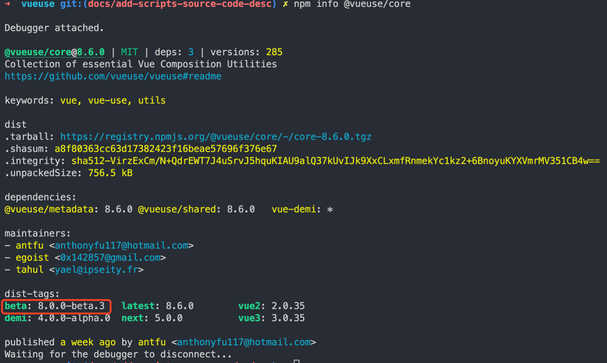

# 从 VueUse 的 scripts 中能学到什么？

大家好，我是码农小余。 在 monorepo 项目中，包构建、生成 changelog、发包等一系列问题经常困扰着我们。现在很多 monorepo 项目使用 pnpm 的 workspaces 能力，但借助 lerna 更新 version 和生成 changelog，这总让人觉得别扭。

今天，我们就从 VueUse 入手，从中学习它的经验并“盗取”它的生态来满足我们自己项目的需求。

## scripts

先总的看一下 VueUse 的 script：

```json
"scripts": {
    "build": "nr update && esno scripts/build.ts",
    "build:redirects": "esno scripts/redirects.ts",
    "build:rollup": "cross-env NODE_OPTIONS=\"--max-old-space-size=6144\" rollup -c",
    "build:types": "tsc --emitDeclarationOnly && nr types:fix",
    "clean": "rimraf dist types packages/*/dist",
    "dev": "nr update && nr docs",
    "docs": "vitepress dev packages --open",
    "docs:build": "nr update:full && vitepress build packages && nr build:redirects && esno scripts/post-docs.ts",
    "docs:serve": "vitepress serve packages",
    "lint": "eslint .",
    "lint:fix": "nr lint --fix",
    "publish:ci": "esno scripts/publish.ts",
    "install-fonts": "gfi install Inter && gfi install Fira Code",
    "release": "esno scripts/release.ts && git push --follow-tags",
    "size": "esno scripts/export-size.ts",
    "test": "nr test:3",
    "test:2": "vue-demi-switch 2 vue2 && vitest run --silent",
    "test:3": "vue-demi-switch 3 && vitest run",
    "test:all": "nr test:3 && nr test:2 && vue-demi-switch 3",
    "test:watch": "vitest --watch",
    "typecheck": "tsc --noEmit",
    "types:fix": "esno scripts/fix-types.ts",
    "update": "nr -C packages/metadata update && esno scripts/update.ts",
    "update:full": "nr update && nr build:types",
    "watch": "esno scripts/build.ts --watch"
}
```

简述每一条脚本的职责：

- build:xx 均用于构建；
- clean 用于删除构建产物；
- dev、docs、docs:build、docs:serve 跟文档相关；
- lint:xx 用于规范代码；
- publish:ci 用于发包；
- release 命令用于更新版本信息并打 tag；
- size 命令用于输出每个包的体积；
- test:xx 均与单元测试相关；
- typecheck 命令借助 tsc 检查类型；
- types:fix 用于修改类型声明；
- update:xx 用于更新 README、下载量、贡献者等信息；
- watch 支持热更的构建；

接下来我们重点了解一些常用和复杂的脚本——update、build、release、test。

## update

`update` 脚本执行的是

```shell
nr -C packages/metadata update && esno scripts/update.ts
```

[nr](https://www.npmjs.com/package/@antfu/ni) 也许你之前没有接触过，它主要的作用：

1. 根据 lock 文件自动识别包管理器；
2. 磨平不同包管理器之间的差异，比如 nx jest 根据包管理器的不同，可能执行 npx jest、yarn dlx jest 或者 pnpm dlx jest。

前半部分 `nr -C packages/metadata update` 表示切换到 `packages/metadata` 目录然后执行 `update` 脚本。（补充：也可以通过 pnpm run update --filter @vueuse/metadata 完成一样的动作，项目中使用了 [@antfu/ni](https://www.npmjs.com/package/@antfu/ni) 所以通过 nr -C 包管理更加一致）。

回到 metadata 包，我们详细了解 update：

```typescript
import { ecosystemFunctions } from '../../../meta/ecosystem-functions'
import { packages } from '../../../meta/packages'

// 读取整个 VueUse 的元数据
export async function readMetadata() {
  // indexes 包括 packages、categories、functions 3个属性
  const indexes: PackageIndexes = {
    packages: {},
    categories: [],
    functions: [
      ...ecosystemFunctions,
    ],
  }

  // ... 省略一堆处理代码
	for (const info of packages) {
  	// ...
  }
  
  return indexes
}

async function run() {
  const indexes = await readMetadata()
  await fs.writeJSON(join(DIR_PACKAGE, 'index.json'), indexes, { spaces: 2 })
}

run()
```

readMetadata 方法比较简单，从 `meta/ecosystem-functions` 和 `meta/packages` 读取元数据，生成 indexes 结果并写入 index.json 文件，打开 index.json 瞄一眼：

```json
{
  "packages": {
    "shared": {
      "name": "shared",
      "display": "Shared utilities",
      "dir": "packages/shared"
    },
    "core": {
      "name": "core",
      "display": "VueUse",
      "description": "Collection of essential Vue Composition Utilities",
      "dir": "packages/core"
    },
    // ...
  },
  "categories": [
    "Animation",
    "Browser",
    "Component",
    "Elements",
    "Misc",
    "Network",
    "Sensors",
    "State",
    "Utilities",
    "Watch",
    "@Electron",
    "@Firebase",
    "@Head",
    "@Integrations",
    "@Motion",
    "@Router",
    "@RxJS",
    "@SchemaOrg",
    "@Sound"
  ],
  "functions": [
    {
      "name": "computedAsync",
      "package": "core",
      "lastUpdated": 1651597361000,
      "docs": "https://vueuse.org/core/computedAsync/",
      "category": "Utilities",
      "description": "computed for async functions",
      "alias": [
        "asyncComputed"
      ]
    },
    {
      "name": "computedEager",
      "package": "shared",
      "lastUpdated": 1645956777000,
      "docs": "https://vueuse.org/shared/computedEager/",
      "category": "Utilities",
      "description": "eager computed without lazy evaluation",
      "alias": [
        "eagerComputed"
      ]
    }
    // ...
   ]
}
```

上述 json 就跟 [VueUse 文档中的信息](https://vueuse.org/functions.html)对应上了。抛开这些，我们看看 readMeta 中那些好用的包：

- [gray-matter](https://www.npmjs.com/package/gray-matter) 用于解析 [front matter](https://vuepress.vuejs.org/zh/guide/frontmatter.html#%E5%85%B6%E4%BB%96%E6%A0%BC%E5%BC%8F%E7%9A%84-front-matter)（是 markdown 文件中的第一部分，并且必须采用在三点划线之间书写的有效的 YAML）；
- [simple-git](https://www.npmjs.com/package/simple-git) 用于在任何 node.js 应用程序中运行 git 命令的轻量级接口，上述的 lastUpdated 字段便是通过 `git log -1 --format=%at xx` 获取的结果；
- [fast-glob](https://www.npmjs.com/package/fast-glob) 是 Node.js 的一个非常快速和高效的 glob 库，快得飞起、支持多种否定匹配模式、支持同步、Promise、Stream API等都是它的亮点。

写入信息之后，update 会执行 `esno scripts/update.ts`:

```typescript
import fs from 'fs-extra'
import { metadata } from '../packages/metadata/metadata'
import { updateContributors, updateCountBadge, updateFunctionREADME, updateFunctionsMD, updateImport, updateIndexREADME, updatePackageJSON, updatePackageREADME } from './utils'

async function run() {
  await Promise.all([
    // 更新各个包的入口文件 index.ts
    updateImport(metadata),
    // 更新每个包的 README
    updatePackageREADME(metadata),
    // 更新根目录的 README
    updateIndexREADME(metadata),
    // 更新附加组件
    updateFunctionsMD(metadata),
    // 更新方法的 README
    updateFunctionREADME(metadata),
    // 更新每个包的 package.json
    updatePackageJSON(metadata),
    // 更新计数徽章
    updateCountBadge(metadata),
    // 更新贡献者
    updateContributors(),
  ])

  await fs.copy('./CONTRIBUTING.md', './packages/contributing.md')
}

run()
```

本文主要是借助 VueUse 去了解 monorepo 项目的脚本框架，不会深入每个操作细节，有需求再回来查看每个函数逻辑即可。

至此，就完成了整个 update 操作，我们接着看 build 过程。

## build

build 脚本执行以下命令：

```sh
nr update && esno scripts/build.ts
```

build 依赖 update 的执行，我们进入 `scripts/build.ts`：

```typescript
if (require.main === module)
  cli()
```

这个判断给你 3s 思考是想表达什么？1-2-3，时间到，请看答案：

>当文件直接从 Node.js 运行时，则 `require.main` 被设置为其 `module`。 这意味着可以通过测试 `require.main === module` 来**确定文件是否被直接运行**。
>
>对于文件 `foo.js`，如果通过 `node foo.js` 运行，则为 `true`，如果通过 `require('./foo')` 运行，则为 `false`。
>
>当入口点不是 CommonJS 模块时，则 `require.main` 为 `undefined`，且主模块不可达。

然后我们进入 build 流程：

```typescript
import { metadata } from '../packages/metadata/metadata'

async function build() {
  consola.info('Clean up')
  exec('pnpm run clean', { stdio: 'inherit' })

  consola.info('Generate Imports')
  // 从上述 update 过程生成的 index.json 中获取，所以脚本顺序上是依赖 nr update 的
  await updateImport(metadata)

  consola.info('Rollup')
  exec(`pnpm run build:rollup${watch ? ' -- --watch' : ''}`, { stdio: 'inherit' })

  consola.info('Fix types')
  exec('pnpm run types:fix', { stdio: 'inherit' })

  await buildMetaFiles()
}
```

build 逻辑也很清晰：

1. 执行 `pnpm run clean` 清除上一次构建结果，也就是删除 types、dist 等目录；等等，这里为什么不用 `nr` 而用了 `pnpm run`？建议给 [antfu](https://github.com/antfu) 提个 PR~
2. 执行 `await updateImport(metadata)` 生成每个包的入口文件（index.ts）；
3. 接着执行 `pnpm run build:rollup` 通过 rollup 完成构建动作，构建配置待会再看；
4. 然后执行 `pnpm run types:fix` 完成 @vue/composition-api、vue 到 vue-demi 的类型修复；
5. 最后更新 metadata 包中的 dist 信息，包括 LICENSE、index.json、package.json。

整个流程清楚之后，我们来深入学习 build:rollup：

```js
/* eslint-disable no-global-assign */
// 使用 esbuild 即时转换 JSX、TypeScript 和 esnext 功能
require('esbuild-register')
module.exports = require('./scripts/rollup.config.ts')
```

查阅 `./scripts/rollup.config.ts`：

```typescript
const esbuildPlugin = esbuild()
const esbuildMinifer = (options: ESBuildOptions) => {
  const { renderChunk } = esbuild(options)

  return {
    name: 'esbuild-minifer',
    renderChunk,
  }
}

// 96-108 行
{
  file: `packages/${name}/dist/${fn}.iife.min.js`,
  format: 'iife',
  name: iifeName,
  extend: true,
  globals: iifeGlobals,
  plugins: [
    injectVueDemi,
    esbuildMinifer({
      minify: true,
    }),
  ],
}

// 112-125
configs.push({
  input,
  output,
  plugins: [
    target
      ? esbuild({ target })
      : esbuildPlugin,
    json(),
  ],
  external: [
    ...externals,
    ...(external || []),
  ],
})
```

rollup 的配置只截取了部分配置，重点学习 rollup 构建中使用 esbuild 能力的过程。在插件部分，iife 输出格式上使用了 [esbuild](https://esbuild.github.io/) 的 [minify ](https://esbuild.github.io/api/#minify) 配置，对于指定 target 的构建需求上，使用了 esbuild 的 [target](https://esbuild.github.io/api/#target) 配置。

构建完了，接下来就看看发版(release)、发布(build)流程

## release、publish

release 流程执行的是：

```sh
esno scripts/release.ts && git push --follow-tags
```

查阅 `scripts/release.ts ` :

```typescript
import { execSync } from 'child_process'
import { readJSONSync } from 'fs-extra'

// 读取 package.json 中的 version 字段
const { version: oldVersion } = readJSONSync('package.json')

// 自动化发布过程
execSync('npx bumpp', { stdio: 'inherit' })

// 再次读取 version 字段
const { version } = readJSONSync('package.json')
// 比较新旧版本、如果一致就退出进程
if (oldVersion === version) {
  console.log('canceled')
  process.exit()
}
// 类型声明构建
execSync('npm run build:types', { stdio: 'inherit' })
// 执行更新
execSync('npm run update', { stdio: 'inherit' })
// add
execSync('git add .', { stdio: 'inherit' })
// commit
execSync(`git commit -m "chore: release v${version}"`, { stdio: 'inherit' })
// 打tag
execSync(`git tag -a v${version} -m "v${version}"`, { stdio: 'inherit' })
```

release 流程非常清晰，上述代码中有一个包引起我的注意力：[bumpp](https://www.npmjs.com/package/bumpp) 基于 [`version-bump-prompt`](https://github.com/JS-DevTools/version-bump-prompt) 添加了以下特性：

- 重命名为 bumpp ，可以直接使用 `npx bumpp`；
- 提供 ESM 和 CJS 构建包；
- 添加一个新参数 `--execute` 以在提交前执行命令;

最后来看 publish 过程：

```sh
esno scripts/publish.ts
```

流程如下：

```typescript
import { packages } from '../meta/packages'

// 执行包的构建
execSync('npm run build', { stdio: 'inherit' })

let command = 'npm publish --access public'

// 如果 version 包含 beta 就在发布命令上添加 tag
if (version.includes('beta'))
  command += ' --tag beta'

// 依次发布每一个包
for (const { name } of packages) {
  execSync(command, { stdio: 'inherit', cwd: path.join('packages', name, 'dist') })
  consola.success(`Published @vueuse/${name}`)
}
```

publish 先执行包的构建，然后定义发布命令，如果 version 中包含 beta 字段，就在发布参数上打上 tag，可以在终端执行 npm info @vueuse/core 查看 beta 包：



最后循环包数据 packages 依次执行 `npm publish --access public ` 进行发包。整个流程可以通过 vueuse 的 [publish action](https://github.com/vueuse/vueuse/runs/6670930037?check_suite_focus=true) 进一步查看。

## 总结


